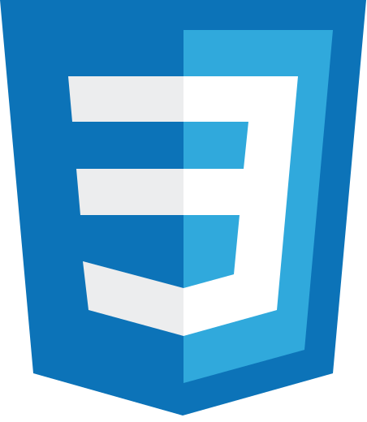

## Hola! 👋 Soy [Nacho](https://www.linkedin.com/in/ignaciofernandezjeansalle/) 👨🏻‍💻

<code></code>
<code>ignaciofj@gmail.com</code>

### Acerca de mí

Soy desarrollador de software e interfaces de usuario en entornos industriales 🏭 hace +17 años. Estoy en la búsqueda de empleo como desarrollador frontend, para lo cual estoy trabajando en mi transformación profesional 💻.

### ¿Qué estuve y estoy haciendo para lograrlo?

<code>2018</code> 

- Hice mi primer proyecto autodidacta frontend, por pura curiosidad. Hice el sitio web de una escuela de buceo utilizando: <code>HTML</code> <code>CSS</code> <code>JavaScript</code> <code>PHP</code>

<code>2022</code> 

- Decidí formarme en _Coderhouse_ como **Desarrollador Frontend React** ➡️ [Certificado](https://www.coderhouse.com/ar/certificados/63ae3137430ba2000ff5d2d0).

<code>2023</code> 

- Al finalizar la carrera en Coderhouse, me premiaron por ser top 10🔝, con un proyecto freelance y desarrollé con un equipo de UX/UI y una PM el sitio web de una nutricionista utilizando: <code>HTML</code> <code>CSS</code> <code>Bootstrap</code> <code>SASS</code> <code>JavaScript</code>

<code>2024</code> 

- Hice la refactorización del sitio de la escuela de buceo aplicando toda la teoría aprendida sobre semántica, SEO, accesibilidad, etc., utilizando: <code>ASTRO</code> <code>HTML</code> <code>SASS</code> <code>JavaScript</code> <code>Typescript</code>  
- Hice la certificación en **Desarrollo Back End y APIs** de _freeCodeCamp_ ➡️ [Certificado](https://www.freecodecamp.org/certification/ignacio-fj-dev/back-end-development-and-apis).
- Hice la certificación en **Full Stack** de _Full Stack Open_ ➡️ [Certificado](https://studies.cs.helsinki.fi/stats/api/certificate/fullstackopen/en/469f8d487b2149b39c2f4cf2cc7f8ca0).

<code>Date.now()</code> 

- Continúo haciendo proyectos y practicando mis habilidades en el desarrollo web.

---

<code></code>
<code></code>
<code></code>
<code></code>
<code></code>
<code></code>
<code></code>
<code></code>
<code></code>
<code></code>
<code></code>

